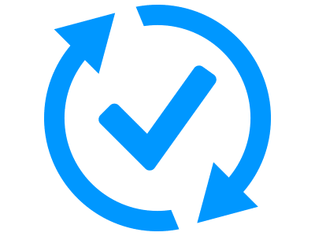

# Welcome to the Nautobot Apps Documentation!

## The Nautobot App Ecosystem

Find out more about what documentation is available for the various Nautobot Apps, both on this site and externally, by visiting the [Nautobot App Ecosystem](nautobot-apps.md) page.

## The Apps

These Nautobot Apps have their documentation hosted as a subproject of this docs site and they are built and structured according to the NTC documentation standards.

| | App Name | Description |
|-| --- | --- |
|  | [Nautobot Device Onboarding](https://nbatest-mm.readthedocs.io/projects/device-onboarding/en/latest/) | Simplify the onboarding process of a new device by allowing the user to specify a small amount of info and having the plugin populate a much larger amount of device data in Nautobot. |
|  | [Nautobot Golden Configuration](https://nbatest-mm.readthedocs.io/projects/golden-config/en/latest/) | Automate configuration backups, perform configuration compliance, and generate intended configurations. |
