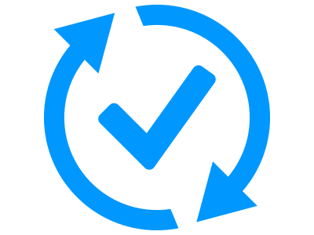

# Welcome to the Nautobot Apps Documentation!

```{admonition} Developer Note - Remove Me!
This is the landing page for this docs website - add the most important messaging here!
```

## The Nautobot App Ecosystem

Find out more about what other Nautobot Apps documentation is available for projects that are not hosted here by visiting the [Nautobot App Ecosystem](nautobot-apps.md) page.

You can also find links to the core Nautobot documentation and other Nautobot related packages over on the [Documentation Landing Page](https://nbdocs.pages.dev).

## The Apps

These Nautobot Apps have their documentation hosted as a subproject of this docs site and they are built and structured according to the NTC documentation standards.

| | App Name | Description |
|-| --- | --- |
|  | [Nautobot Device Onboarding](https://nbatest-main.readthedocs.io/projects/device-onboarding/en/latest/) | Simplify the onboarding process of a new device by allowing the user to specify a small amount of info and having the plugin populate a much larger amount of device data in Nautobot. |
|  | [Nautobot Golden Configuration](https://nbatest-main.readthedocs.io/projects/golden-config/en/latest/) | Automate configuration backups, perform configuration compliance, and generate intended configurations. |


```{toctree}
:maxdepth: 1
Nautobot App Ecosystem <nautobot-apps>
App Docs Hosted Elsewhere <apps-docs-elsewhere.md>
```

```{toctree}
:maxdepth: 1
:caption: Hosted App Documentation
Nautobot Device Onboarding <https://nbatest-main.readthedocs.io/projects/device-onboarding/en/latest/>
Nautobot Golden Configuration <https://nbatest-main.readthedocs.io/projects/golden-config/en/latest/>
```
